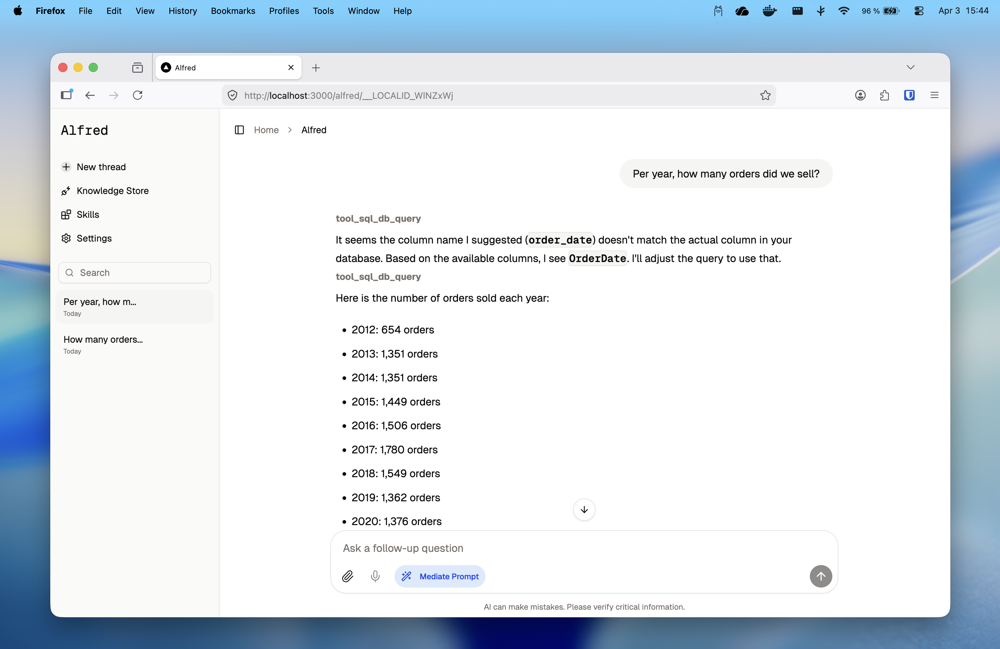
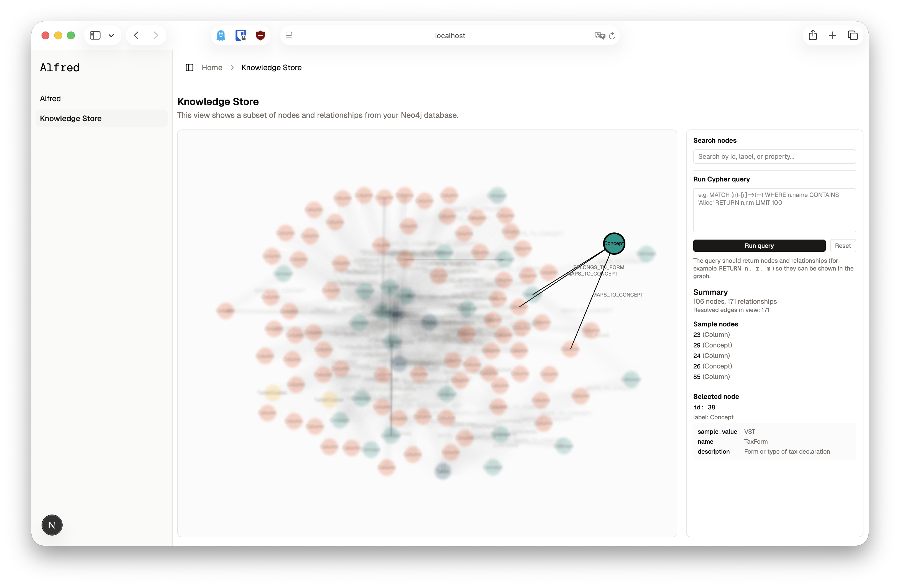

# Alfred

An open, inspectable AI data assistant for working with semantic knowledge graphs and structured domain data.

Most production-grade data assistants today are **not open source** and expose only a narrow text box on top of a proprietary stack. This creates three concrete problems:

1. **Opaque, closed implementations**  
   Commercial text-to-SQL and "AI copilot" systems are typically proprietary. Their prompts, tools, and safety constraints are not inspectable, and it is hard to understand why a query was generated or how it could fail on your infrastructure.

2. **Text-to-SQL without explicit semantics**  
   Modern LLMs can synthesize SQL, but realistic domains depend on rich semantics: business concepts, slowly evolving schemas, non-obvious join paths, and domain-specific constraints. In many systems this knowledge is implicit in dashboards, tribal knowledge, or code – the model is expected to "guess" it from a few examples, which is brittle and hard to govern.

3. **Hidden knowledge engineering and invisible semantic layer**  
   The hard work of knowledge engineering (naming entities, defining relationships, curating constraints) usually happens off-screen. End users and domain experts rarely see or can navigate the semantic layer itself; they only interact with final charts or answers. This makes it difficult to debug, improve, or align the assistant with the real domain.

Alfred addresses these issues by providing an **open, inspectable reference implementation**:

- A **semantic knowledge graph explorer** that makes the domain model and its relationships first-class and navigable.
- A **persistent, multi-thread chat interface** built on Assistant UI, wired to the same semantic layer and data tools.
- A **single, well-defined persistence layer** for chat history (default: local SQLite) that can be replaced with your own database.

It uses natural language understanding, multi-source data querying, and reasoning tools to help users explore, analyze, and extract insights from structured domain data in a transparent way. While Alfred is currently wired to Neo4j, Databricks, and Azure OpenAI, it is intentionally backend-agnostic: you can swap in other databases, knowledge graphs, or AI engines without changing the core interaction patterns.



Alfred also includes a semantic knowledge store / graph explorer for navigating the domain model and relationships:




## Use Case: Domain Adoption with Semantic Knowledge Graphs

Alfred helps teams adopt data assistants by making domain knowledge explicit in a semantic graph. Users can:

- Understand domain concepts and their relationships
- Navigate complex data structures through natural conversation
- Discover connections and patterns across the knowledge base

## Features

- **Knowledge Graph Explorer**: Visually explore your semantic knowledge graph and inspect relationships between domain entities
- **Persistent Multi-Thread Chat**: Assistant-UI based conversational interface with thread history stored in a local SQLite database by default
- **Pluggable Storage Layer**: Swap the default SQLite persistence for your own database by re-implementing a small set of functions in `lib/db.ts`
- **Natural Language Queries**: Ask questions about your data and knowledge graph in plain language
- **Multi-Source Support**: Query Databricks, SQL databases, and Neo4j knowledge graphs seamlessly
- **Structured Reasoning**: Built-in thinking tool for complex analysis tasks
- **Real-time Streaming**: Get responses as they're generated
- **Tool-based Architecture**: Extensible system for adding custom data tools
- **Microphone Input (Dictation)**: Optional voice input for composing messages via the browser's Web Speech API (if supported by the browser), with graceful fallback when unsupported
- **Image & File Attachments**: Attach images (e.g. screenshots) directly in the chat to give the assistant richer context

## Technology Stack

- **Frontend**: Next.js 16+ with React 19 and Assistant UI for pre-built conversational interface
- **AI Engine**: Vercel AI SDK using Azure OpenAI
- **Data Platforms**: Databricks SQL, Neo4j knowledge graphs
- **UI**: Radix UI components with Tailwind CSS

## Prerequisites

- Node.js 18+
- npm or pnpm

## Installation


```bash
npm install
```

## Environment Setup

Create a `.env.local` file in the project root with:

```env
AZURE_OPENAI_API_KEY=your_api_key
AZURE_OPENAI_BASE_URL=https://...
AZURE_OPENAI_MODEL=gpt-...

# Databricks
DATABRICKS_HOST=your_workspace_url
DATABRICKS_HTTP_PATH=your_http_path
DATABRICKS_TOKEN=your_personal_access_token
DATABRICKS_CATALOG=your_databricks_catalog
DATABRICKS_SCHEMA=your_databricks_schema

# Neo4j
NEO4J_URI=bolt://...
NEO4J_USER=neo4j
NEO4J_PASSWORD=your_password
```

## Running Locally

```bash
npm run dev
```

The application will be available at `http://localhost:3000`.

## Building for Production

```bash
npm run build
npm start
```

## Project Structure

- `app/` - Next.js application and API routes
- `components/` - React components for UI and assistant-ui interface
- `lib/tools/` - Data query tools and utilities for Databricks, SQL, and Neo4j
- `lib/prompts/` - System prompt(s) for the AI model

## Configuring Databricks and Neo4j Tools

Alfred exposes its main data access paths as **tools** under `lib/tools/`. These tools are wired into the assistant runtime via the Vercel AI SDK and Assistant UI so the model can call them directly.

### Databricks (SQL) tool

- Implementation: `lib/tools/tool_sql_db_query.ts`
- Environment variables:
  - `DATABRICKS_HOST`, `DATABRICKS_HTTP_PATH`, `DATABRICKS_TOKEN` (connection details)
  - `DATABRICKS_CATALOG`, `DATABRICKS_SCHEMA` (default catalog/schema used for qualifying tables)

The tool:
- Enforces that only **single SELECT/CTE queries** are allowed (no INSERT/UPDATE/DELETE/DDL).
- Automatically qualifies unqualified tables with `DATABRICKS_CATALOG` and `DATABRICKS_SCHEMA`.
- Delegates actual execution to `executeDatabricksSQL` in `lib/tools/utils_tools.ts`.

To adapt it to your environment:
- Set the Databricks variables in `.env.local` to point to your workspace, token, and catalog/schema.
- If you want to change how queries are executed (e.g., different client or warehouse), update `executeDatabricksSQL` accordingly.
- If your catalog/schema layout is different, adjust the qualification logic in `tool_sql_db_query.ts` or remove it and fully qualify tables in the prompt and/or tool description.

### Neo4j (graph) tool

- Implementation: `lib/tools/tool_neo4j_query.ts`
- Environment variables:
  - `NEO4J_URI`, `NEO4J_USER`, `NEO4J_PASSWORD`

The tool:
- Creates a shared Neo4j driver and session via the official `neo4j-driver` package.
- Exposes a single `tool_neo4j_query` that runs arbitrary Cypher and returns records as plain JavaScript objects.

To adapt it:
- Point `NEO4J_URI`, `NEO4J_USER`, and `NEO4J_PASSWORD` to your database.
- If you use multiple databases within the same cluster, adjust `getSession(database)` to pick the appropriate Neo4j database, or expose multiple tools with different defaults.
- If you need stricter query controls (e.g., disallow writes), add validation similar to `tool_sql_db_query.ts`.

## Acknowledgement

Alfred grew out of ongoing research on AI-assisted data systems conducted at a university in Germany and supported in part by a large energy supplier. The code in this repository is a personal evening side project and simplified reference implementation; it may differ substantially from any systems used in professional or production settings. Alfred builds on the work of the open-source community, including Next.js, React, Vercel AI SDK, Neo4j, Databricks, Radix UI, and others.

## Contributing & Extending Alfred

We encourage researchers and practitioners to extend Alfred with their own innovations. Examples include:

- **Custom Data Sources & Tools**: Connect additional databases or build domain-specific query and analysis tools
- **Multi-Modal & Visualization Support**: Add document integration and richer visualizations for tool outputs and reasoning steps
- **Conversation & Collaboration Features**: Improve long-term conversation memory, add follow-up suggestions, or enable shared analysis workspaces

We welcome pull requests, suggestions, and discussions about how Alfred can better serve your research or practice needs.

## Using a Personal Database for Chat History

Chat threads and messages are persisted through a single server-side abstraction in `lib/db.ts`. To swap the default SQLite database for your own (e.g. Postgres, MySQL, or a cloud database):

1. **Keep the public API stable**: Preserve the exported types and function signatures in `lib/db.ts` (`ThreadRecord`, `MessageRecord`, `getThreads`, `createThread`, `updateThread`, `deleteThread`, `getMessages`, `appendMessage`, `deleteMessagesByThreadId`).
2. **Replace the implementation**: Remove the `better-sqlite3` setup and SQL statements and reimplement these functions using your preferred database client (e.g. Prisma, Drizzle, pg, Sequelize) and schema.
3. **Stay server-only**: Ensure `lib/db.ts` is only imported from server-side code (API routes under `app/api/threads`), and configure your own connection options via environment variables as needed.

No changes are required in the Assistant UI integration (`components/alfred/runtime-provider.tsx`); once `lib/db.ts` is wired to your database, chat history will automatically use your personal backend.

### Multi-User and Production Setups

The default schema treats all threads as belonging to a single logical user, which is sufficient for local development. For real multi-user deployments:

- **Add a userId column** to the `threads` table (and optionally `messages`) and backfill existing rows with a stable local id (e.g. `"local-dev"`).
- **Extend the helpers in `lib/db.ts`** to accept a `userId` argument and scope all queries by that id (e.g. `getThreads(userId)`, `createThread(userId, ...)`).
- **Derive `userId` from auth** in your API routes (e.g. from a session/JWT) in production, or use a fixed `"local-dev"` value during development.

This keeps user handling in the persistence layer and API routes, while the Assistant UI integration remains unchanged.