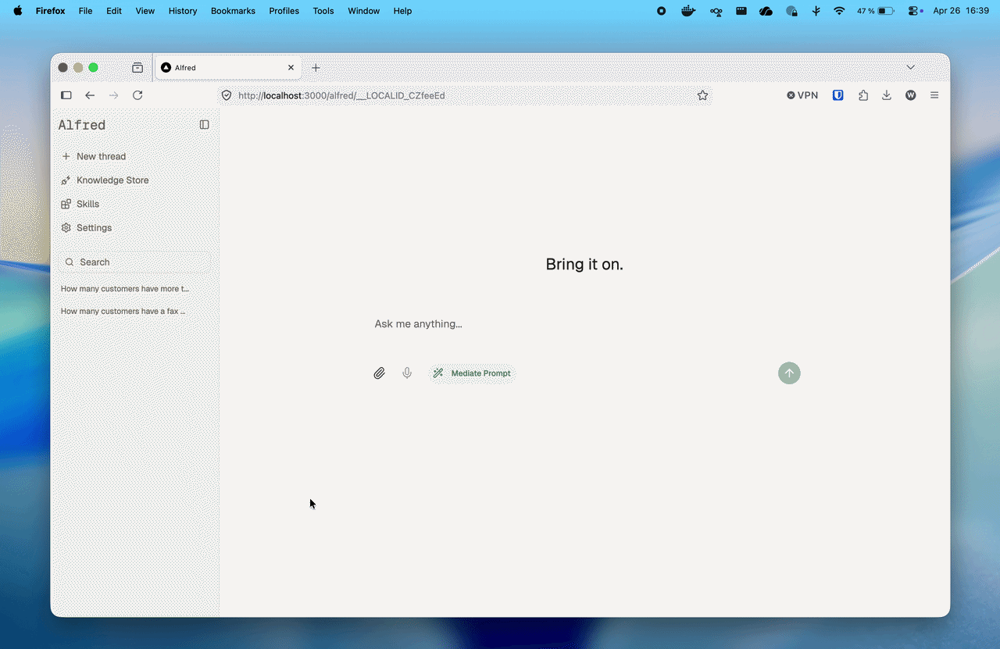
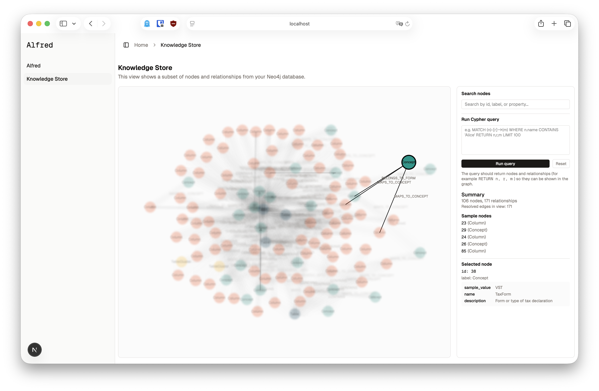

# Alfred
[](#features)
[](#domain-adoption-with-semantic-knowledge-graphs)
[](#features)
[](https://www.reddit.com/r/AlfredAI/)

An open, inspectable AI data assistant for working with Agent Skills, semantic knowledge graphs and structured domain data.



Most production-grade data assistants today are **not open source** and expose only a narrow text box on top of a proprietary stack. This creates three concrete problems:

1. **Opaque, closed implementations**  
   Commercial text-to-SQL and AI assistants are usually proprietary. Their prompts, tools, and safeguards are not transparent, which makes it difficult to understand how queries are produced or why they might fail in a given infrastructure.

2. **Text-to-SQL without explicit semantics**  
   LLMs can generate SQL, but real domains rely on rich semantics such as business concepts, evolving schemas, complex joins, and domain rules. In many systems this knowledge remains implicit in dashboards, code, or internal knowledge, forcing the model to infer it from few examples, which is fragile and hard to govern.

3. **Hidden knowledge engineering and invisible semantic layer**  
   Much of the knowledge engineering work, including defining entities, relationships, and constraints, happens behind the scenes. Domain experts rarely interact with the semantic layer itself and only see final outputs like charts or answers. This makes debugging, improving, and aligning the assistant with the real domain more difficult.

Alfred addresses these issues by providing an **open, inspectable reference implementation**:

- A **semantic knowledge graph explorer** that makes the domain model and its relationships first-class and navigable.
- A **persistent, multi-thread chat interface** built on Assistant UI, wired to the same semantic layer and data tools
- A **single, well-defined persistence layer** for chat history (default: local SQLite) that can be replaced with your own database.
- A **pluggable model abstraction layer** that lets you seamlessly switch between providers (e.g., OpenAI, Azure OpenAI, or local models like Ollama).

It uses natural language understanding, multi source data querying, and reasoning tools to help users explore and analyze structured domain data transparently. While Alfred currently connects to Neo4j, Databricks, and Azure OpenAI, it remains backend agnostic and can integrate other databases, knowledge graphs, or AI engines without changing the core interaction patterns.

Alfred also includes a **knowledge graph explorer** for navigating your domain model and relationships, a dedicated **skills workspace** for creating and editing capabilities, and a **centralized settings page** where everything can be configured.



## Domain Adoption with Semantic Knowledge Graphs

Alfred helps teams adopt data assistants by making domain knowledge explicit in a semantic graph. Users can:

- Understand domain concepts and their relationships
- Navigate complex data structures through natural conversation
- Discover connections and patterns across the knowledge base

## Features

- **Agent Skills**: Extend Alfred's capabilites by adding skills to the ```alfred-app/mnt/skills directory```.
- **Persistent Multi-Thread Chat** with
**Pluggable Chat History**: Swap the default SQLite persistence for your own database by re-implementing a small set of functions in `lib/db.ts`
- **Natural Language Queries**: Ask questions about your data plain language
- **Tool-based Architecture**: Extensible system for adding custom data tools
- **Microphone Input (Dictation)** (if supported by the browser) and **Image & File Attachments**
- **Knowledge Graph Explorer**: Visually explore your semantic knowledge graph and inspect relationships between domain entities
- **Personalization**: Customize Alfred’s behavior with skills managed in your file explorer or custom instructions set via the settings page

## Technology Stack

- **Frontend**: Next.js 16+ with React 19 and Assistant UI for pre-built conversational interface
- **AI Engine**: Vercel AI SDK using Azure OpenAI
- **Data Platforms**: Databricks SQL, Neo4j knowledge graphs
- **UI**: Radix UI components with Tailwind CSS

## Prerequisites

- Node.js 18+
- npm or pnpm

## Installation

Install [Node.js](https://nodejs.org/en) and [Docker](https://docs.docker.com/engine/install/). Run afterwards in your terminal:

```bash
cd alfred-app
npm install
```

## Encryption of Alfred user settings (API keys, tokens, passwords)

Alfred stores per-user configuration (chat models, Databricks, Neo4j, etc.) in a local SQLite database under `alfred-app/data/alfred.sqlite`. To avoid storing secrets like API keys, tokens, and passwords im Klartext, Alfred supports transparent encryption at rest.

- Sensitive settings are stored in the `user_settings` table and can be encrypted with **AES-256-GCM**.
- Encryption is controlled via a single environment variable in your `alfred-app/.env.local`:

```env
ALFRED_ENCRYPTION_KEY=...
```

Requirements and behavior:

- The key must represent **32 bytes (256 Bit)** – recommended format is a 64-character hex string (you can generate one with `openssl rand -hex 32`).
- When a valid key is set, Alfred encrypts/decrypts all sensitive settings in `user_settings` transparently.
- If no valid key is configured, the app still works, but secrets are stored as plain JSON in SQLite (only recommended for local development and testing).

## Environment Setup for the Knowledge Store

A .env files are necessary for the creation of the neo4j graph from databricks. When the alfred-app is running, those credentials can be added in the settings page.

```env
# Azure
AZURE_OPENAI_API_KEY=your_api_key
AZURE_OPENAI_BASE_URL=https://.../openai/
AZURE_API_VERSION=yyyy-MM-dd
AZURE_OPENAI_EMBEDDING_MODEL=text-embedding-3-large
AZURE_OPENAI_DEPLOYMENT=gpt-5.1

# Databricks
DATABRICKS_HOST=your_workspace_url
DATABRICKS_HTTP_PATH=your_http_path
DATABRICKS_TOKEN=your_personal_access_token
DATABRICKS_CATALOG=your_databricks_catalog
DATABRICKS_SCHEMA=your_databricks_schema

# Neo4j
NEO4J_BOLT_URL=bolt://...:7687
NEO4J_USERNAME=neo4j
NEO4J_PASSWORD=your_password
``` 

## Getting started from scratch

If you want to try Alfred and you do not have a concrete Databricks dataset nor a knowledge graph, you can start first with the [Databricks Free Edition](https://www.databricks.com/learn/free-edition). From databricks you get your credentials for your ```.env```:

``` bash
DATABRICKS_HOST=....databricks.com
DATABRICKS_TOKEN=your_personal_access_token
DATABRICKS_WAREHOUSE_ID=your_warehouse_id
DATABRICKS_CATALOG=your_databricks_catalog
DATABRICKS_SCHEMA=your_databricks_schema
```

Add then to your ```.env``` the (default) credentials for neo4j knowledge graph (the neo4j will be build in the next step):

```
NEO4J_BOLT_URL=bolt://localhost:7687
NEO4J_USERNAME=neo4j
NEO4J_PASSWORD=password
```

Next, we build and run both alfred and neo4j community edition with docker. The Alfred app itself can run without access to the database or the graph.

```
cd alfred-app
docker compose build .

# Start the service
docker compose up
```
If you run into package or native module issues (like better-sqlite3), rebuild without cache:
```

docker compose build --no-cache
```

Next, access the applications:
- **Neo4j Browser:** [http://localhost:7474](http://localhost:7474)  
- **Alfred App:** [http://localhost:8081](http://localhost:8081)

Afterwards, there are a couple of helper notebooks in the `scripts/` folder to integrate databricks data in your Free Edition and to build the knowledge graph.

- `scripts/create_databricks_schema.ipynb`
  - Use this to **initialize a sample dataset in Databricks**.
  - This notebook is meant to be **run directly in your Databricks workspace** (e.g. imported into Databricks and executed from there), since it relies on Databricks runtime and connectivity.

- `scripts/create_graph_from_databricks.ipynb`
  - Use this to **build the semantic knowledge graph** from the data stored in Databricks and push it into Neo4j.
  - This is designed to be **run on your local machine** where it can access your Databricks tables and talk to Neo4j.

Finally, go again into the [Alfred App](http://localhost:8081) and add the credentials of your ai model, your embedding model, your neo4j credentials and your databricks workspace. All should be set up now.

In a typical flow you would:
1. Get to know the basics of using Neo4j and Databricks.
2. If you not have any data in databricks, you open `create_databricks_schema.ipynb` in Databricks and run it to set up the sample schema and data.
3. Configure your Databricks and Neo4j credentials via environment variables as described above.
3. Open `create_graph_from_databricks.ipynb` on your local machine and run it to materialize the knowledge graph in Neo4j.
4. Run Alfred, add credentials in the settings section and start asking questions.

Please note: These notebooks are intentionally simple and are meant as a starting point you can fork and adapt to your own schemas, business concepts, and graph modeling conventions.

The core domain **concepts** used in the example knowledge graph live in `scripts/data/concepts.yaml` (with a big acknowledgement to *Kenneth Leungh* for the original concept definitions). If you want to bring your own domain, you can start by tweaking this file – adding, renaming, or removing concepts – and then re-running the graph creation notebook to see how your changes show up in Neo4j and in Alfred's UI.

## Alfred-App Project Structure

- `app/` - Next.js application and API routes
- `components/` - React components for UI and assistant-ui interface
- `mnt/skill` - Agent Skills for Alfred
- `lib/tools/` - Alfred's tools: View files, Data query tools and utilities for Databricks, SQL, and Neo4j
- `lib/prompts/` - System prompt(s) for the application

## Configuring Databricks and Neo4j Tools

Alfred exposes its main data access paths as **tools** under `lib/tools/`. These tools are wired into the assistant runtime via the Vercel AI SDK and Assistant UI so the model can call them directly.

## Using a Personal Database for Chat History

Chat threads and messages are persisted through a single server-side abstraction in `lib/db.ts`. To swap the default SQLite database for your own (e.g. Postgres, MySQL, or a cloud database):

1. **Keep the public API stable**: Preserve the exported types and function signatures in `lib/db.ts` (`ThreadRecord`, `MessageRecord`, `getThreads`, `createThread`, `updateThread`, `deleteThread`, `getMessages`, `appendMessage`, `deleteMessagesByThreadId`).
2. **Replace the implementation**: Remove the `better-sqlite3` setup and SQL statements and reimplement these functions using your preferred database client (e.g. Prisma, Drizzle, pg, Sequelize) and schema.
3. **Stay server-only**: Ensure `lib/db.ts` is only imported from server-side code (API routes under `app/api/threads`), and configure your own connection options via environment variables as needed.

No changes are required in the Assistant UI integration (`components/alfred/runtime-provider.tsx`); once `lib/db.ts` is wired to your database, chat history will automatically use your personal backend.

### Multi-User and Production Setups

The default schema treats all threads as belonging to user using a browser based cookie, which is sufficient for local development. For real multi-user deployments, **derive a `userId` from auth** in your API routes (e.g. from a session/JWT) in production, or use a fixed `"local-dev"` value during development.

## Contributing & Extending Alfred

We encourage researchers and practitioners to extend Alfred with their own innovations. Examples include:

- **Custom Data Sources & Tools**: Connect additional databases or build domain-specific query and analysis tools
- **Multi-Modal & Visualization Support**: Add document integration and richer visualizations for tool outputs and reasoning steps
- **Conversation & Collaboration Features**: Improve long-term conversation memory, add follow-up suggestions, or enable shared analysis workspaces

We welcome pull requests, suggestions, and discussions about how Alfred can better serve your research or practice needs.

## Acknowledgement

Alfred grew out of ongoing research on AI-based data assistants. The code in this repository is a personal evening side project. Alfred builds on the work of the open-source community, including Next.js, React, Vercel AI SDK, Neo4j, Databricks, Radix UI, and others.