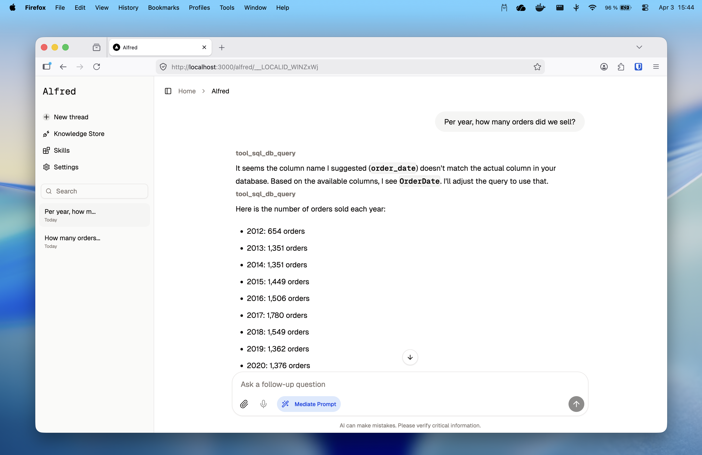

# Alfred
[](#)
[](#)
[](#)
[](#)
[](#)
[](#)

Say it. Query it. Own it.



Open source is how data stays free. However, most production-grade text-to-sql assistants are **not open source** and expose only a narrow text box on top of a proprietary stack. 
Alfred addresses this by providing a research-first open-source application:

- A **semantic knowledge graph** that makes the domain model and its relationships first-class and navigable.
- A **persistent, multi-thread chat interface** built on Assistant UI.
- A **single, well-defined persistence layer** for chat history that can be replaced with your own database.
- A **pluggable model abstraction layer** that lets you seamlessly switch between providers (e.g., OpenAI, Azure, or local models like Ollama or LM-Studio).

## Features

- **Help with your Knowledge Graph**: Generate your first knowledge graph in an UI and adapt it with domain entities
- **Persistent Multi-Thread Chat** with
**Pluggable Chat History**: Swap the default SQLite persistence for your own database by re-implementing a small set of functions in `lib/db.ts`
- **Natural Language Queries**: Ask questions about your data plain language
- **Tool-based Architecture**: Extensible system for adding custom data tools
- **Microphone Input (Dictation)** (if supported by the browser) and **Image & File Attachments**
- **Agent Skills**: Extend Alfred's capabilites by adding skills to the ```alfred-app/mnt/skills directory```.

## Technology Stack

- **Frontend**: Next.js 16+ with React 19 and Assistant UI for pre-built conversational interface
- **AI Engine**: Vercel AI SDK using Azure OpenAI
- **Data Platforms**: Databricks SQL, Neo4j knowledge graph
- **UI**: Radix UI components with Tailwind CSS

## Prerequisites

- Node.js 18+
- npm or pnpm

## Installation

Install [Node.js](https://nodejs.org/en) and [Docker](https://docs.docker.com/engine/install/). Run afterwards in your terminal:

```bash
cd alfred-app
npm install
```

## Environment Setup for the Knowledge Store

The .env file provides Alfred with credentials for chat, embeddings, and databases. Chat and embedding settings should be configured depending on the provider (Azure or OpenAI). Keep this file private and do not commit it to version control. See `.env.example` and create your `.env.local` within the alfred-app directory. Feel free to user the provider of your choice, from azure to ollama (openai compatible).

```
# Run Alfred using openai-compatible model, e.g. ollama, lm-studio,...
CHAT_PROVIDER=openai
OPENAI_API_KEY=ollama
OPENAI_BASE_URL=e.g. http://localhost:11434/v1/
OPENAI_CHAT_MODEL= e.g. gpt-oss:20b

# Or run Alfred using any azure deployment
CHAT_PROVIDER=azure
AZURE_OPENAI_BASE_URL=https://xxxxxxxx.com/openai/
AZURE_OPENAI_API_VERSION=xxxx-xx-xx
AZURE_OPENAI_CHAT_DEPLOYMENT=gpt-5.1

...
# Databricks and Neo4j credentials
``` 

## Getting started from scratch

If you want to try Alfred and you do not have a concrete Databricks dataset nor a knowledge graph, you can start first with the [Databricks Free Edition](https://www.databricks.com/learn/free-edition). Run the script `create_databricks_schema.ipynb` to get your first data into databricks. From databricks you get your credentials for your ```.env```:

``` bash
DATABRICKS_HOST=....databricks.com
DATABRICKS_TOKEN=your_personal_access_token
DATABRICKS_WAREHOUSE_ID=your_warehouse_id
DATABRICKS_CATALOG=your_databricks_catalog
DATABRICKS_SCHEMA=your_databricks_schema
```

Add then to your ```.env``` the (default) credentials for neo4j knowledge graph (the neo4j will be build in the next step):

``` bash
NEO4J_BOLT_URL=bolt://localhost:7687
NEO4J_USERNAME=neo4j
NEO4J_PASSWORD=password
```

Next, we build and run both alfred and neo4j community edition with docker. The Alfred app itself can run without access to the database or the graph.

```
cd alfred-app
docker compose build .

# Start the service
docker compose up
```
If you run into package or native module issues (like better-sqlite3), rebuild without cache:
```

docker compose build --no-cache
```

Next, access the applications:
- **Neo4j Browser:** [http://localhost:7474](http://localhost:7474)  
- **Alfred App:** [http://localhost:8081](http://localhost:8081)

Finally, go to the settings page, click on **Reset knowledge graph database**. Nodes and edges for your graph will be generated from your choosen database schema. Now your Alfred, add domain infos and start asking questions.

## Configuring Databricks and Neo4j Tools

Alfred exposes its main data access paths as **tools** under `lib/tools/`. These tools are wired into the assistant runtime via the Vercel AI SDK and Assistant UI so the model can call them directly.

## Using a Personal Database for Chat History

Chat threads and messages are persisted through a single server-side abstraction in `lib/db.ts`. To swap the default SQLite database for your own (e.g. Postgres, MySQL, or a cloud database):

1. **Keep the public API stable**: Preserve the exported types and function signatures in `lib/db.ts` (`ThreadRecord`, `MessageRecord`, `getThreads`, `createThread`, `updateThread`, `deleteThread`, `getMessages`, `appendMessage`, `deleteMessagesByThreadId`).
2. **Replace the implementation**: Remove the `better-sqlite3` setup and SQL statements and reimplement these functions using your preferred database client (e.g. Prisma, Drizzle, pg, Sequelize) and schema.
3. **Stay server-only**: Ensure `lib/db.ts` is only imported from server-side code (API routes under `app/api/threads`), and configure your own connection options via environment variables as needed.

No changes are required in the Assistant UI integration (`components/alfred/runtime-provider.tsx`); once `lib/db.ts` is wired to your database, chat history will automatically use your personal backend.

### Multi-User and Production Setups

The default schema treats all threads as belonging to user using a browser based cookie, which is sufficient for local development. For real multi-user deployments, **derive a `userId` from auth** in your API routes (e.g. from a session/JWT) in production, or use a fixed `"local-dev"` value during development.

## Contributing & Extending Alfred

We encourage researchers and practitioners to extend Alfred with their own innovations. Examples include:

- **Custom Data Sources & Tools**: Connect additional databases or build domain-specific query and analysis tools
- **Multi-Modal & Visualization Support**: Add document integration and richer visualizations for tool outputs and reasoning steps
- **Conversation & Collaboration Features**: Improve long-term conversation memory, add follow-up suggestions, or enable shared analysis workspaces

We welcome pull requests, suggestions, and discussions about how Alfred can better serve your research or practice needs.

## Acknowledgement

Alfred grew out of ongoing research on AI-based data assistants. Alfred builds on the work of the open-source community, including Next.js, React, Vercel AI SDK, Neo4j, Databricks, Radix UI, and others.